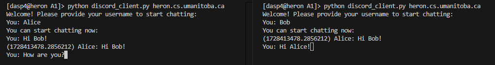
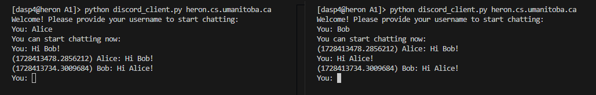
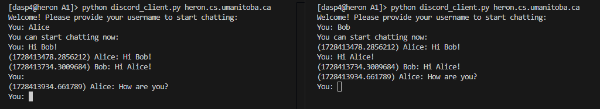

Part 1 of this Assignment has been completed in **Python** and **JavaScript**. Part 2 of the assignment has been completed with **C** and **Python**. Please refer to this document to know how to execute the files and about the bugs and the fixes in the code.

## Table of Contents
- [Part 1: Execution](#part-1-execution) 
    - [Hosting Chat Server](#to-host-the-chat-server)
    - [Hosting Webserver](#to-host-the-webserver)
    - [Web Client connections](#chubby-a2-client-connections)
    - [Thin Client connections](#thin-a1-client-connections)
    - [Run with telnet/nc](#to-run-with-telnet-or-netcat)
    - [Disconnect Client](#how-to-disconnect-client-from-server)
    - [Disconnect from Server](#how-to-stop-the-server-or-webserver)
- [Part 1: Features](#part-1-features)
- [Part 1: Bugs and Fixes](#part-1-bugs--fixes)
- [Part 2: Execution](#part-2-execution)
    - [How to use makefile](#how-to-use-makefile)
    - [How to use scraper.c](#how-to-use-scraperc)
- [Part 2: Features](#part-2-features)

## Part 1: Execution 
The files that are needed for the Part 1 are:
- `discord_server.py` : runs the chat server
- `webserver.py` : runs the web server
- `script.js` : chubby client for assignment 2
- `discord_client.py` : thin client from assignment 1
- `index.html` : frontend

### To Host the Chat Server
Run the following command in your terminal to host the chat server.
```
python discord_server.py
```
After you successfully hosted the server, the screen will show you that the server has successfully started:
```markdown
[dasp4@hawk webfiles]> python discord_server.py
Chat server started, waiting for connections...
```

### To Host the Webserver
Run the following code in your terminal to host your webserver.
```
python webserver.py
```
After you successfully hosted the webserver, the screen will show you the port number where your client can connect to.
```markdown
[dasp4@hawk webfiles]> python webserver.py 
Web server running on port 8211
```

### Chubby (A2) Client Connections
To connect a client to the webserver, follow these steps:

1. Open a **New Incognito Window** on **Google Chrome**.
2. Write the following in your broswer window. The port number is **8211**
``` markdown
http://aviary.cs.umanitoba.ca:8211
```

### Thin (A1) Client Connections

Thin clients can join the server in two ways. To run the client code please follow the structure of the following command.
```
python discord_client.py <server_name>
```
So for example, if your server is running on `crow.cs.umanitoba.ca` then run 
```
python discord_client.py crow.cs.umanitoba.ca
```

### To Run with Telnet or Netcat
Another way in which client can join the server is with `telnet` or `nc`. Log into your `aviary.cs.umanitoba.ca` account using `SSH` and then follow the structure of the command
```
telnet <server_name> <port_number>
```
The port number is **8210**. If your server is running on `crow.cs.umanitoba.ca` then you will run:
```
telnet crow.cs.umanitoba.ca 8210
```
You can also use `nc` in a very similar way
```
nc crow.cs.umanitoba.ca 8210
```

### How to Disconnect Client from Server
- **Web client:** To logout from the chat, you need to click on the `Logout` Button on the chat window. Closing the browser would not sign out the client as your saved cookies will identify you the next time you open a browser.

- **Thin client:** There are two ways in you can disconnect a thin client from the server. You can either enter `quit` when you want to exit from the chat or you can hit `Ctrl+C`.

### How to Stop the Server or Webserver
To stop the server or the webserver you have to hit `Ctrl+C` from your keyboard.

---
## Part 1: Features
This chat server is persistent and will show upto 10 older messages when a client successfully logs in. The chat history is maintained in `chat_history.JSON` file which will be automatically created on your system when you start chatting for the first time. A sample file has been provided with this assignment to showcase the persistence.

### Web Clients
When you connect to `aviary.cs.umanitoba.ca` at port 8211 you will be prompted to enter a username. Before you enter your username, you **would not** be able to receive any prior or incoming messages. 

To send a message you need to click on **Send** and to logout, click on **Logout**. If you close your browser without logging out, your cookies will be held and you will automatically be logged in once you open another browser window.


### Thin Clients
Upon connecting a client, the server will ask the client for a username. Until the client provides a valid username, they **would not** be able to receive any incoming messages or view any older messages from history. This is what this feature would look like:
```markdown
[dasp4@heron A1]> python discord_client.py heron.cs.umanitoba.ca
Welcome! Please provide your username to start chatting:
You: 
```
If you provide a valid username, you will be able to view all older messages. This was done with the thought of security and authentication in  mind, and also because it makes it look similar to the web client.

```markdown
[dasp4@heron A1]> python discord_client.py heron.cs.umanitoba.ca
Welcome! Please provide your username to start chatting:
You: Alice
You can start chatting now:
(1728410292.4039567) bob: hi
(1728410304.888814) frank: hi bob
(1728410308.1316512) bob: hi frank
(1728410317.4825277) bob: meh
(1728410323.6061094) frank: hru????ok
You: 
```
An example of an invalid username would be `quit`, as the server would assume that the client wants to leave the chat and hence it would disconnect them.
```markdown
[dasp4@heron A1]> python discord_client.py heron.cs.umanitoba.ca
Welcome! Please provide your username to start chatting:
You: quit
Disconnected from server
```
---
## Part 1: Bugs & Fixes
I was able to partially fix the message interlacing problem of the UI. To explain my progress let's assume there there are two clients- Alice and Bob. In the screenshot attached, the left is Alice's chat and the right is Bob's chat. In this image we can see that both of our clients are currently typing.



Now, Bob hits 'Enter' and sends his message.



Bob's message is successfully sent to the chat without any overlapping. However, we have lost the message that Alice was typing. This lost message has only vanished from the screen but it is veru much present in our buffer. So if Alice simply hits 'Enter', she would be able to send her previously typed message.



This is because of this part of the code that I wrote in the client program which brings the cursor to the beginning of the current line and then clears the line. 

```markdown
# Bring cursor to the beginning of the current line and clear the line
sys.stdout.write('\r\033[K')
print('\r' + data.decode().strip())
```
I tried using the `curses` library to fix the overlapping UI but I wasn't able to go much further with that. This issue has been there since assignment 1 for which my marks have been deducted already, so I am hoping there wouldn't be any deduction this time.

---
## Part 2: Execution
The files needed for this part are the ones from Part 1 and the following:
- `scraper.c`
- `makefile`

Please host the `discord_server.py` and `webserver.py` before you run any client files. The steps to host these servers are linked [here](#part-1-execution).

### How to use makefile
You can use the `makefile` to run and compile the code in `scraper.c`. 

Please follow this structure:
``` {markdown}
make run <server_name> <port_number> <username> <message>
```
The port number has to be **8211**. The message needs to be typed within " ".

Let's say you are on `crow.cs.umanitoba.ca` and you want to send the message "Hello, World!", then you would type the following:
``` {markdown}
make run crow.cs.umanitoba.ca 8211 Alice "Hello, World!"
```

### How to use scraper.c
If you want to use`scraper.c` directly to run the code, you have to follow these steps:
```
gcc scraper.c -o scraper
./scraper <server_name> <port_number> <username> <message>
```
The port number has to be **8211**. The message needs to be typed within " ".

Let's say you are on `crow.cs.umanitoba.ca` and you want to send the message "Hello, World!", then you would type the following:
``` {markdown}
./scraper crow.cs.umanitoba.ca 8211 Alice "Hello, World!"
```
---

## Part 2 Features
A new api request is added to the webserver that checks if the username sent by the scraper is already in the list of logged in users or not.
```
elif request.startswith('GET /api/status'):
    if 'session_id=' in request:
        session_id = request.split("session_id=")[1].split()[0]
        if session_id in cookies:
            headers = 'HTTP/1.1 200 OK\r\n\r\n'
            conn.send(headers.encode() + session_id.encode())
        else:
            conn.send(b'HTTP/1.1 401 Unauthorized\r\n\r\n') 
```
This chunk looks for the given username in the list of cookies. If it exists within the list, then further GET and POST requests are accepted by the server. If it does not exist then then webserver sends an `Error 401: Unauthorized`. 

The verification of the POST message is done with the help of a GET query. The assertion here checks if `response` has `chat_message` as a substring.
```
assert(strstr(response, chat_message) != NULL && "Error 404: Not Found");
```
